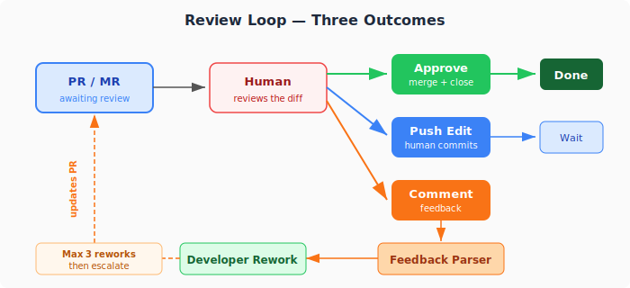
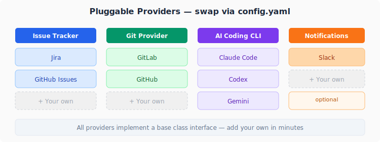

# Auto Developer

**Ticket  ->  AI Agents  ->  Pull Request  ->  Review Loop**

An open-source pipeline that automates the full development lifecycle. When a ticket is marked ready, AI agents take over — they brainstorm approaches, write an implementation plan, code the solution, and open a pull request. The human reviewer stays in control: approve, edit, or leave feedback that triggers an automatic rework cycle.

No manual handoffs. No copy-pasting tickets into prompts. Just move a ticket to "Ready for Development" and the code shows up as a PR.

---

## How It Works

<p align="center">
  
</p>

**The pipeline in 30 seconds:**
- A ticket arrives (via webhook or manual API call)
- **Python server drives phases one at a time** — each phase invokes a focused agent and tracks state
- **Phase 1 — Analyze:** Orchestrator reads the full Jira ticket, writes `TICKET.md`, posts analysis as Jira comment
- **Phase 2 — Plan:** Brainstorm agent explores the codebase, writes `PLAN.md`, posts plan summary as Jira comment
- **Phase 3 — Implement:** Developer agent implements from the plan, commits code, creates PR/MR
- Jira ticket transitions through statuses: Ready for Dev → Development → Done
- **Human reviews** — approve to merge, or comment to trigger a rework cycle
- **Feedback parser** structures the review comments, developer agent applies fixes
- Loop until approved or rework limit hit (then escalate)
- Every phase is tracked with timing, error details, and artifacts in `.pipeline-state/`

---

## Review Loop

<p align="center">
  
</p>

After the PR is created, the pipeline pauses and waits for the human reviewer. Three outcomes:

| Action | What happens |
|--------|-------------|
| **Approve** | PR merged, ticket closed, team notified |
| **Push edits** | Pipeline detects human commits, waits for approval |
| **Comment feedback** | Feedback parser + developer rework cycle (max 3 rounds) |

---

## Pluggable Providers

<p align="center">
  
</p>

Everything is swappable via a single `config.yaml`. Add your own providers by extending a base class — see [Custom Providers Guide](docs/custom-providers.md).

---

## Quick Start

```bash
git clone https://github.com/regojoyson/auto-developer.git
cd auto-developer

./setup.sh     # interactive TUI wizard — configures everything
./start.sh     # validates, starts server, prints webhook URLs
```

`./setup.sh` walks you through a step-by-step terminal wizard:

1. **Pre-flight check** — detects installed tools, shows what's missing
2. **Repository** — local dir / parent dir / clone from URL + base branch
3. **Issue tracker** — Jira / GitHub Issues + trigger & done status
4. **Git provider** — GitLab / GitHub + API token (masked input, saved to .env)
5. **AI coding CLI** — Claude Code / Codex / Gemini + optional model
6. **Notifications** — optional Slack channel
7. **Pipeline settings** — port, rework limit, timeout, output handlers
8. **Summary** → confirm → writes `config.yaml` + `.env` + symlinks agents

No manual file editing needed — the wizard handles everything including tokens.
Project IDs and owner/repo are auto-detected from git remote URLs.

**Re-running `./setup.sh`** on an existing config gives three options:
- **Re-link only** — keep config, just re-symlink agent files
- **Reconfigure** — edit current settings with values pre-filled (press Enter to keep)
- **Start fresh** — blank config from scratch

```bash
./stop.sh      # stops everything, cleans up
```

Trigger manually without a webhook:
```bash
curl -X POST http://localhost:3000/api/trigger \
  -H 'Content-Type: application/json' \
  -d '{"issueKey": "PROJ-42", "summary": "Add login page"}'
```

Check status, view agent logs, cancel:
```bash
curl http://localhost:3000/api/status/PROJ-42          # pipeline state
curl http://localhost:3000/api/status/PROJ-42/logs      # real-time agent output
curl -X DELETE http://localhost:3000/api/status/PROJ-42  # cancel & re-trigger
```

Watch agent output in real-time:
```bash
tail -f logs/agents/PROJ-42-orchestrator.log
```

---

## Console (Optional)

A React-based web console for monitoring and triggering pipelines. Requires the API server to be running on port 3000.

```bash
cd console
npm install        # first time only
npm run dev        # starts on http://localhost:3001
```

To stop the dashboard:
```bash
# Press Ctrl+C in the terminal running the dashboard
# Or kill the process:
lsof -ti:3001 | xargs kill
```

Features: live pipeline list with auto-refresh, pipeline detail view, real-time log viewer with agent filtering, and a trigger form.

---

## Documentation

| Doc | What it covers |
|-----|---------------|
| **[Prerequisites](docs/prerequisites.md)** | What to install before starting (Node, CLI, MCP servers, tokens) |
| **[Setup Guide](docs/setup.md)** | Step-by-step from zero to running |
| **[How It Works](docs/how-it-works.md)** | Full pipeline flow, agents, review loop |
| **[Configuration](docs/configuration.md)** | All `config.yaml` options with examples |
| **[API Spec](docs/api-spec.md)** | Every HTTP endpoint, request/response formats |
| **[OpenAPI Spec](docs/openapi.yaml)** | Import into Postman, Swagger UI, or any API tool |
| **[Custom Providers](docs/custom-providers.md)** | Add your own issue tracker, git provider, CLI, or notification |
| **[Spec Document](docs/spec.md)** | Architecture, agent contracts, risks |

---

## Project Structure

```
auto-developer/
├── agents/                      # Agent prompts (CLI-agnostic)
│   ├── orchestrator.md
│   ├── brainstorm.md
│   ├── developer.md
│   ├── feedback-parser.md
│   └── RULES.md                 # Global rules (symlinked per CLI)
├── src/
│   ├── server.py                # FastAPI webhook server
│   ├── config.py                # Unified config loader (reads config.yaml)
│   ├── routes/                  # issue_tracker, git_provider, trigger, status
│   ├── providers/               # Pluggable adapters
│   │   ├── base.py              # ABC base classes (4 types)
│   │   ├── trackers/            # Jira, GitHub Issues
│   │   ├── git/                 # GitLab, GitHub
│   │   ├── cli/                 # Claude Code, Codex, Gemini
│   │   └── notifications/       # Slack
│   ├── state/manager.py         # Pipeline state machine (phase tracking, artifacts, errors)
│   ├── repos/resolver.py        # Repo resolver (3 modes)
│   └── executor/
│       ├── runner.py            # Spawns AI coding CLI processes
│       └── pipeline.py          # Phase runner (drives analyze → plan → implement → review)
├── console/             # Optional React dashboard (port 3001)
├── mcp_servers/                 # GitLab + GitHub MCP servers (Python)
├── docs/                        # All documentation + diagrams
├── requirements.txt             # Python dependencies
├── config.yaml                  # Single config file (generated by setup.sh)
├── .env                         # Secrets only (tokens)
└── setup.sh / start.sh / stop.sh
```

---

## License

ISC
