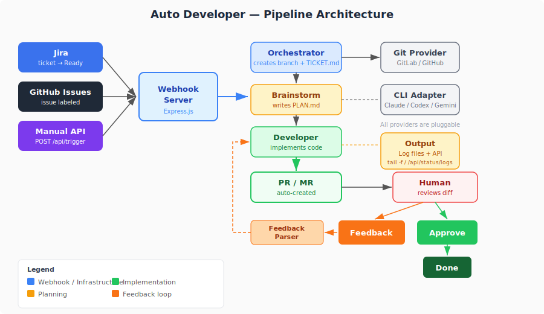

# Auto Developer

**Ticket  ->  AI Agents  ->  Pull Request  ->  Review Loop**

An open-source pipeline that automates the full development lifecycle. When a ticket is marked ready, AI agents take over — they brainstorm approaches, write an implementation plan, code the solution, and open a pull request. The human reviewer stays in control: approve, edit, or leave feedback that triggers an automatic rework cycle.

No manual handoffs. No copy-pasting tickets into prompts. Just move a ticket to "Ready for Development" and the code shows up as a PR.

## Architecture

<p align="center">
  
</p>

**The pipeline in 30 seconds:**
- A ticket arrives (via webhook or manual API call)
- **Orchestrator** checks out the latest base branch, creates a feature branch
- **Brainstorm agent** explores the codebase, writes `PLAN.md` with the best approach
- **Developer agent** implements from the plan, commits code
- A **PR/MR is created** automatically with description and file change summary
- **Human reviews** — approve to merge, or comment to trigger a rework cycle
- **Feedback parser** structures the review comments, developer agent applies fixes
- Loop until approved or rework limit hit (then escalate)

**Everything is pluggable** — swap issue trackers (Jira, GitHub Issues), git providers (GitLab, GitHub), AI CLIs (Claude Code, Codex, Gemini), and notification channels (Slack) via a single `config.yaml`.

---

## Quick Start

```bash
git clone https://github.com/regojoyson/auto-developer.git
cd auto-developer

./setup.sh     # interactive wizard — generates config
# fill in tokens in .env
./start.sh     # validates, starts server + ngrok
```

```bash
./stop.sh      # stops everything, cleans up
```

Trigger manually without a webhook:
```bash
curl -X POST http://localhost:3000/api/trigger \
  -H 'Content-Type: application/json' \
  -d '{"issueKey": "PROJ-42", "summary": "Add login page"}'
```

---

## What It Supports

Everything is pluggable via `config.yaml`:

| Layer | Supported | Add your own? |
|-------|-----------|---------------|
| Issue Tracker | Jira, GitHub Issues | Yes — extend `IssueTrackerBase` |
| Git Provider | GitLab, GitHub | Yes — extend `GitProviderBase` |
| AI Coding CLI | Claude Code, Codex, Gemini | Yes — extend `CliAdapterBase` |
| Notifications | Slack (optional) | Yes — extend `NotificationBase` |
| Repo Mode | Local dir, parent dir, clone from URL | Via config |

---

---

## Documentation

| Doc | What it covers |
|-----|---------------|
| **[Setup Guide](docs/setup.md)** | Step-by-step from zero to running |
| **[How It Works](docs/how-it-works.md)** | Full pipeline flow, agents, review loop |
| **[Configuration](docs/configuration.md)** | All `config.yaml` options with examples |
| **[API Spec](docs/api-spec.md)** | Every HTTP endpoint, request/response formats |
| **[OpenAPI Spec](docs/openapi.yaml)** | Import into Postman, Swagger UI, or any API tool |
| **[Spec Document](docs/spec.md)** | Architecture, agent contracts, risks |

---

## Project Structure

```
auto-developer/
├── .claude/
│   ├── agents/                  # Agent prompts (orchestrator, brainstorm, developer, feedback-parser)
│   ├── CLAUDE.md                # Global rules for all agents
│   └── settings.json            # MCP server config (auto-generated)
├── src/
│   ├── config.js                # Unified config loader (reads config.yaml)
│   ├── webhook/                 # Express server + route handlers
│   │   ├── server.js
│   │   └── routes/
│   │       ├── issue-tracker.js # Issue tracker webhooks
│   │       ├── git-provider.js  # Git provider webhooks
│   │       ├── trigger.js       # Manual trigger API
│   │       └── status.js        # Pipeline status API
│   ├── providers/               # Pluggable adapters
│   │   ├── base/                # Abstract base classes
│   │   ├── trackers/            # Jira, GitHub Issues
│   │   ├── git/                 # GitLab, GitHub
│   │   ├── cli/                 # Claude Code, Codex, Gemini
│   │   └── notifications/       # Slack
│   ├── state/manager.js         # Pipeline state machine
│   ├── repos/resolver.js        # Repo directory resolver (3 modes)
│   └── agents/runner.js         # CLI process spawner
├── mcp-servers/
│   ├── gitlab/                  # GitLab MCP server (8 tools)
│   └── github/                  # GitHub MCP server (8 tools)
├── docs/                        # All documentation
├── config.yaml                  # Single config file
├── .env                         # Secrets (tokens only)
├── setup.sh / start.sh / stop.sh
└── package.json
```

---

## Adding Custom Providers

All adapters extend a base class. To add a new one:

1. Create a file in the right `src/providers/` subdirectory
2. Extend the base class and implement the required methods
3. Add a `case` in the factory file

Example — adding Linear as an issue tracker:

```js
const { IssueTrackerBase } = require('../base/issue-tracker-base');

class LinearAdapter extends IssueTrackerBase {
  get name() { return 'linear'; }
  get eventLabel() { return 'issue'; }
  parseWebhook(headers, payload, config) { /* ... */ }
}
module.exports = new LinearAdapter();
```

Base classes validate at startup — missing methods throw immediately.

---

## License

ISC
