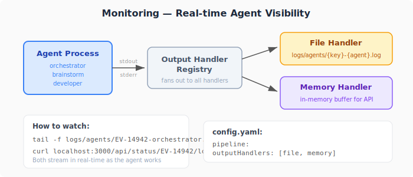

[< Back to README](../README.md) | [Prerequisites](prerequisites.md) | [Setup](setup.md) | [Configuration](configuration.md) | [API Spec](api-spec.md) | [Custom Providers](custom-providers.md)

---

# How It Works

This document explains the full pipeline — from ticket to merged code.

---

## Overview

```
  Ticket Created                        Code Merged
       │                                     ▲
       ▼                                     │
  ┌─────────┐    ┌───────────┐    ┌──────────────┐    ┌─────────┐
  │ Webhook  │───▶│Orchestrator│───▶│  Brainstorm  │───▶│Developer │
  │ Receiver │    │   Agent    │    │    Agent     │    │  Agent   │
  └─────────┘    └───────────┘    └──────────────┘    └────┬─────┘
                       ▲                                    │
                       │                                    ▼
                  ┌────┴─────┐                      ┌──────────────┐
                  │ Feedback │◀─────────────────────│  PR / MR     │
                  │  Parser  │     Review comment    │  Created     │
                  └──────────┘                      └──────────────┘
```

---

## Phase 1: Trigger

A ticket becomes ready for development. This can happen two ways:

**Automatic (webhook):**
The issue tracker sends a webhook when the ticket status changes to the configured `triggerStatus` (e.g. "Ready for Development"). The route also listens for **comments on blocked tickets** — a new comment on a ticket the pipeline previously marked `blocked` resumes the run from plan.

**Manual (API call):**
```bash
curl -X POST http://localhost:3000/api/trigger \
  -d '{"issueKey": "PROJ-42"}'
```

Either way, the pipeline does the same thing next.

---

## Phase 2: Preparation

Before any agent starts, the pipeline:

1. **Reads the full ticket** via the issue tracker's REST API (summary, description, acceptance criteria, comments, attachments metadata, linked issues, all custom fields).
2. **Resolves the target repo(s)** — based on `config.yaml` repo mode. In `parentDir` mode, the repo-picker agent chooses which sub-repos the ticket touches.
3. **Prepares each repo** — `git stash --include-untracked`, checkout + reset to `origin/<baseBranch>`, pull latest.
4. **Creates pipeline state** — a JSON file per feature branch.
5. **Responds immediately** — the webhook gets a response, everything after runs async.

---

## Phase 3: Analyze (per repo, on base branch)

For each chosen repo, the **analyze agent** runs with the working tree on the base branch (no feature branch yet):

1. Reads the pre-fetched ticket data injected into its prompt.
2. Explores the repo (read-only).
3. Writes `TICKET.md` with the restated problem, acceptance criteria mapping, assumptions, and risks.

If the agent decides the ticket lacks enough detail, it emits `blocked: true` with a reason. The pipeline then:
- Transitions the state machine to `blocked`.
- Posts a Jira comment describing what's missing and asks the reporter to reply.
- Sets the Jira ticket to `blockedStatus`.
- Stops. A new comment on the ticket resumes from plan.

---

## Phase 4: Post analyze summary to Jira → transition to Development

After every repo finishes analyze successfully, the pipeline:

1. Posts the contents of each `TICKET.md` as a Jira comment (prefixed with the repo name in multi-repo mode).
2. Transitions the Jira ticket to `developmentStatus` (e.g. "Development").

Only now does the feature branch get created.

---

## Phase 5: Plan → implement → MR (per repo)

For each repo:

1. **Create the remote feature branch** from base and commit `TICKET.md` to it.
2. **Plan agent** — writes `PLAN.md` (file-by-file change list, test plan, risks). Can also emit `blocked: true` if planning reveals the task is under-specified.
3. **Post `PLAN.md` to Jira** as a comment, then commit `PLAN.md` to the branch.
4. **Implement agent** — makes the code changes locally on the feature branch.
5. **Python** pushes the branch and opens the PR/MR (agents never touch `git push` or `gh pr create`).

---

## Phase 6: Finish

After all repos complete:

- One aggregate Jira comment lists every repo's MR URL.
- The ticket transitions to `doneStatus` (e.g. "Code Review").
- Slack notification sent (if configured).
- Pipeline state moves to `awaiting-review` and **pauses** — waiting for a human.

---

## Phase 7: Review Loop

The human reviewer reads the diff and has three options:

### Option A: Approve

- Reviewer approves the PR/MR
- Pipeline transitions the ticket to "Done"
- Notification sent: "PROJ-42 merged successfully"
- Done.

### Option B: Push edits

- Reviewer pushes their own commits to the branch
- Pipeline detects the human push, does nothing — waits for approval
- Reviewer can then approve normally (back to Option A)

### Option C: Comment feedback

- Reviewer posts a comment on the PR/MR
- **Feedback Parser Agent** reads the comment thread, produces `FEEDBACK.md`:
  ```
  ## Change Requests
  ### 1. [File: src/login.js, Line: 42]
  Rename `processLogin` to `handleLogin`
  ### 2. [General]
  Add error handling for timeout case
  ```
- **Developer Agent** (rework mode) reads `FEEDBACK.md` and applies only the requested changes
- New commit pushed, PR updated with changelog
- Reviewer re-notified
- Back to **awaiting-review** — loop repeats

### Rework limit

After 3 rework cycles (configurable), the pipeline stops and sends an escalation:
"PROJ-42 has exceeded the rework limit — human intervention needed"

---

## Pipeline States

```
analyzing → planning → developing → awaiting-review → merged
    ↓          ↓          |              ↓       ↑
  blocked ← ←  +----------+          reworking ──┘
    ↓                          |
 planning (resumes on        failed
 Jira comment)
```

| State | What's happening |
|-------|-----------------|
| `analyzing` | Analyze agent is writing TICKET.md on the base branch |
| `planning` | Plan agent is writing PLAN.md on the feature branch |
| `developing` | Implement agent is writing code, Python pushes & opens the MR |
| `awaiting-review` | PR/MR is open, waiting for human review |
| `reworking` | Feedback parser + implement (rework) are applying review comments |
| `blocked` | Analyze/plan flagged unclear requirements; Jira comment resumes from plan |
| `merged` | PR approved, ticket closed |
| `failed` | Pipeline encountered an unrecoverable error |

You can check the current state anytime:
```bash
curl http://localhost:3000/api/status
curl http://localhost:3000/api/status/PROJ-42
```

---

## Monitoring

<p align="center">
  
</p>

While agents run, their output streams in real-time to pluggable output handlers:

| Method | Command |
|--------|---------|
| **Log files** | `tail -f logs/agents/PROJ-42-orchestrator.log` |
| **API** | `curl http://localhost:3000/api/status/PROJ-42/logs` |
| **API (one agent)** | `curl http://localhost:3000/api/status/PROJ-42/logs?agent=brainstorm` |
| **Server log** | `tail -f logs/server.log` |

Configure which handlers are active in `config.yaml`:
```yaml
pipeline:
  outputHandlers:
    - file      # logs/agents/ — tail -f
    - memory    # API — /api/status/{key}/logs
```

---

## Artifacts

Each ticket produces three markdown files on the feature branch:

| File | Written by | Contains |
|------|-----------|----------|
| `TICKET.md` | Orchestrator | Full ticket context from issue tracker |
| `PLAN.md` | Brainstorm agent | Implementation plan with file changes |
| `FEEDBACK.md` | Feedback parser | Structured review comments (only during rework) |

---

## What runs where

| Component | Runs from | Accesses |
|-----------|-----------|----------|
| Webhook server | Auto-pilot directory | HTTP endpoints |
| Agents (via CLI) | Target repo directory (cwd) | Local filesystem for context |
| Git operations | GitLab/GitHub REST API | Remote — no local git push |
| Issue tracker | Jira/GitHub MCP | Remote API |
| Notifications | Slack MCP | Remote API |

The auto-pilot server and the target repo can be on the same machine but in different directories. Agents read local files for context but commit code remotely via the git provider API.
